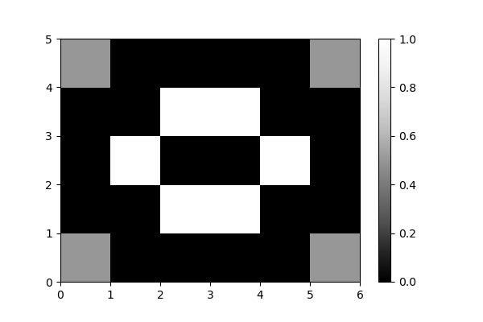
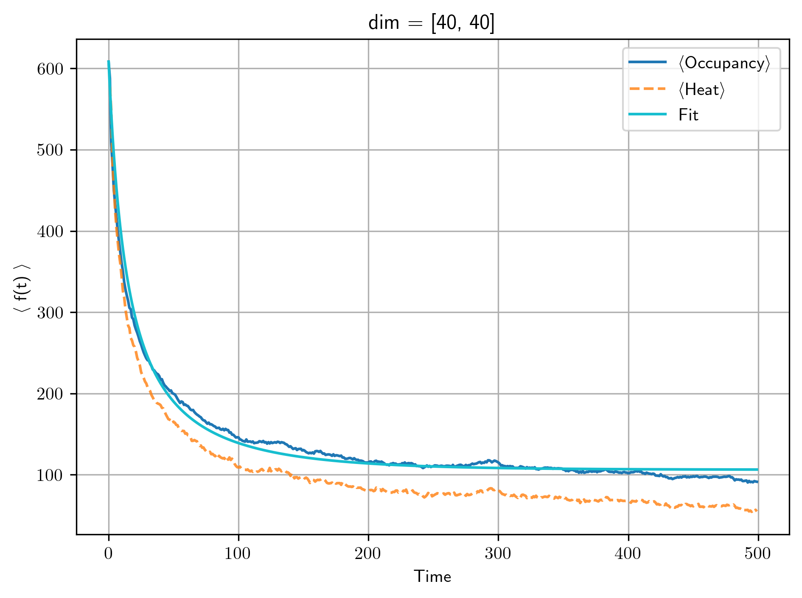
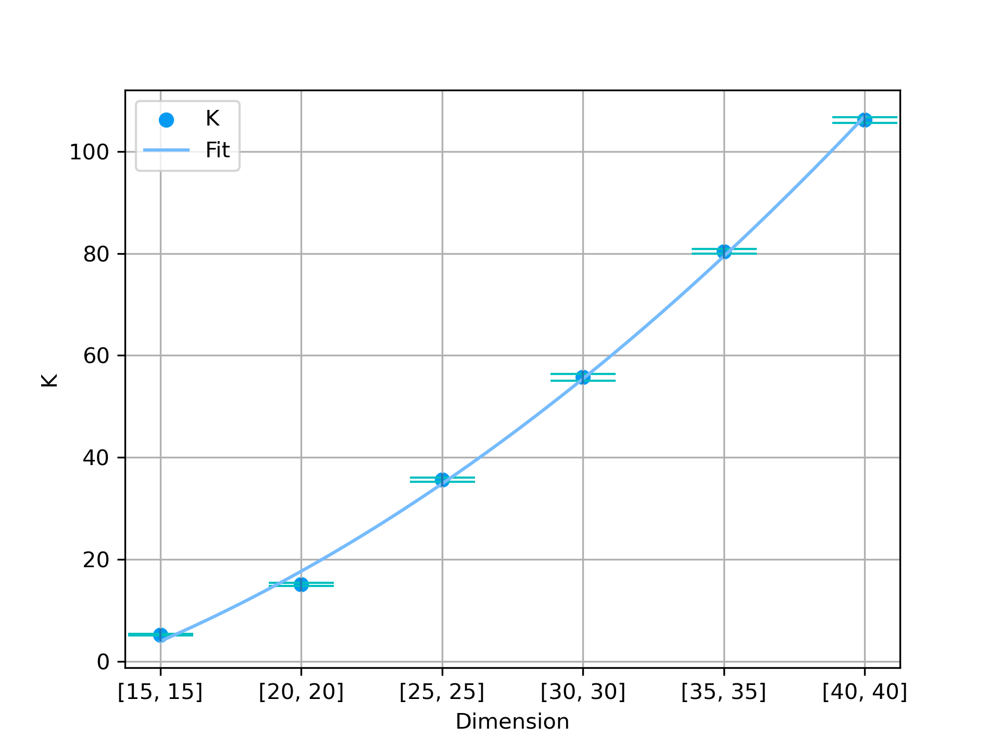

# GameofLife

Game of Life - Laboratory of Computational Physics - Mod A
Feltrin Antonio, Sardo Infirri Giosuè, Tancredi Riccardo, Toso Simone

<div align="center">
    
    
    
</div>

## Introduction

*Conway's Game of Life* (GoL) is perhaps the most famous cellular automaton. The board consists of a grid of *cells*, each either *alive* or *dead*. At each step the board is updated according to the following rules:

1. An alive cell with less than two live neighbours dies (i.e. its state goes from *alive* to *dead*)
2. An alive cell with more than three live neighbours dies
3. An alive cell with two or three live neighbours stays alive
4. A dead cell with three live neighbours becomes alive.

```python
#1st rule: freeze
if neighbors[i,j] == 2:
	new_grid[i,j] = old_grid[i,j]
#2nd rule: birth  
elif neighbors[i,j] == 3:
	new_grid[i,j] = 1
#3rd rule: death
else: 
	new_grid[i,j] = 0
```

### Our project

We implemented the rules of GoL in Python, simulating it with periodic boundary conditions and using the Pygame library to create the visual interface. Running `main.py`, the user can choose the initial configuration (details below) and look at how the game evolves. Finally, we analysed some observable quantities gathered from our games (occupancy, lifespan).

## The code

### Board definition (board.py)

The game's rules are defined in `board.py`, in which we define the `Toroid` class. The board of the game is pictured as a matrix of values in ${0,1}$, in which each entry represents a cell which is either *dead* (0) or *alive* (1). The class `Toroid` is called whenever we run a new game. Depending on what we want to do, we might want to randomly initialize the game or to start from a specific grid. For this purpose, the class constructor takes in input various parameters.

```python
class Toroid:
    def __init__(self, grid=None, seed=None, period=None, image=None, dimension=None, native=50): 
```

In order, we have:

* `grid`: a numpy array of rank 2 containing 0 (dead) and 1 (alive) entries. If `grid` is not `None`, then game's board is initialised to `grid`.
* `seed`: seed for the random number generator, in case we want to randomly initialize the matrix.
* `dimension`: a list containing height and width of the grid, in case we want to randomly initialize the matrix.
* `native`: probability to initialize a cell as *alive*. The default value is 50 (50% probability).

The class contains various methods, called either when running the game or during analysis. The most important for running the game are `search_surround` and `update`. The `search_surround(self, pos)` method counts the number of alive neigbours for the cell indexed by `pos`. The `update(self)` method updates the grid, switching to 0 the cells who die, to 1 the cells who are born and keeping at 1 the cells who stay alive.

### Board analysis (board.py)

A most interesting feature in the Game of Life is seeing the board transition from a disordered soup to a constellation of ordered structures (patterns).  Patterns can live forever if nothing interferes with them, and they belong to one of three classes:

* still lifes: as the name suggests, they stay still.
* oscillators: they change forms, returning cycliclally to the first one every T iterations. "T" is called "period"
* spaceships: they travel across the board.

The board.py file contains functions and variables used to analyse the game. We'll define _occupancy_ $o(t)$ as the number of cells alive at a particular time and _heat_ $h(t)$ as the sum of born and dead cells at time $t$.
The `search_patterns` function counts the number of occurrencies of a given pattern in the whole board at a given moment. We need to take into account the toroidal structure of the board: in order to do so, we expand it with the `Ipad` function. In this way we can find patterns that are split by the edge of the board itself. `search_patterns` also consider flipped and rotated variants of the desired pattern.



Patterns are stored in filters as the one displayed above. The search_patterns functions search for matches of the filter in the padded board, without considering the grey cells (0.5 value) in the filter. This guarantees a standardized match formatting, since the position of the match refers to the top left corner of the filter, while allowing a flexible filter shape.

### draw.py

In order to graphically see our board, we have used `pygame` to display the game evolution. The `Draw class` takes in input the `display.set_mode` function, containing the dimensions of the window and the Toroid class.

```python
class Toroid:
    def __init__(self, grid=None, seed=None, period=None, image=None, dimension=None, native=50): 
```

The latter is essential to use the grid info (alive and dead cells): to draw the alive (white) cells, the `draw_cells` function from `Toroid` is used in order to convert the position on the grid to that in pixels on the pygame window.

### main.py

In the file `main.py` we allow the user to run the game, choosing how to initialize the board. The terminal prompts the user to choose among certain options; the user replies by writing the answer.

The choices are *random*, *fromTxt* and *easterEgg*.

* *random*: randomly initialize the grid. The user is then asked to input the seed for the random number generator and the vertical and horizontal dimension of the grid.
* *fromTxt*: initialize the grid to a specific configuration described in a `.txt` file, stored by the user in the `initial_patterns` folder. The format in which the file has to be written is the following:

  ```txt
  dim_ver,dim_hor
  noise
  pattern_name1,i1,j1,chir1
  pattern_name2,i2,j2,chir2
  pattern_name3,i3,j3,chir3
  ...

  ```

  `dimx` and `dimy` are the height and width of the grid; `noise` is either `True` or `False` and selects whether we want to add random noise (i.e. random 1s on the grid with probability 0.5) to the board. Finally, the last rows position patterns from `pattern_zoo` in desidered positions: for example, the row

  ```
  loaf,0,4,True
  ```

  positions the pattern named *loaf* with its top left corner on cell (0,4); the boolean value `chir` ("chirality") chooses whether we want to flip the pattern around the vertical axis (`True`) or keep it as it is written in the dictionary. The function called to generate the grid starting from the .txt file is defined in `pattern_generator.py`.
* *easterEgg*: We added this option just for fun. The terminal asks to input a keyword among a certain list of special patterns (*monalisa*,*einstein*,...). The initial configurations where simply obtained by reducing the size of a photo to the desired number of pixels and then running [Floyd-Steinberg Dithering](https://en.wikipedia.org/wiki/Floyd%E2%80%93Steinberg_dithering) to convert each pixel to a black/white value (code in `image_generator.py`).

## Data analysis

In this section we present the results we got by analysing the data gathered by running the game on various grid sizes and with different initial configurations.

### Average lifespan

Since the rules of the game are deterministic, if the board finds itself in the same configurations at two different steps it will enter a loop. We say that the evolution has *stabilized* when it enters an infinite loop. We can therefore define the *lifespan* of an initial configuration as the number of steps it takes for it to enter a loop. [Nathaniel Johnston](http://www.njohnston.ca/2009/07/the-maximal-lifespan-of-patterns-in-conways-game-of-life/) observed that, when fixing a certain nativity value, the distribution of  lifespans tend to decay exponentially. In the following graph we show the distributions we found by running the game on various nativities.

### Occupancy and Heat analysis

Together with the _Average lifespan_ analysis we have have also computed an analysis based on *occupancy* and *heat*.

|  Occuapncy & Heat  | K quadratic behaviour |
| :----------------: | :-------------------: |
|  |        |

We can see how, as expected, the heat follows the occupancy. The fit is performed by considering a model for population expansion with a maximum carrying capacity $K$, given by the following logistic equation $$\dot{x}=rx(1-\frac{x}{K})$$ where r is the rate of re_production in absence of density regulation.
Even though this model is not actually built for the game of life itself which has its own deterministic rules, the solution to the differential equation, $x(t)=\frac{Kx_0e^{rt}}{K+x_0(e^{rt}-1)}$ represents a good fit of our data, since an exponeential fit does not take into account the fact that, as shown in all our simulations, there can still be a fraction of alive particles, even after long time: this is of course reasonable since we are considering finite dimension grids.
We have found that the fraction of particles still alive $K=x(t\to\infty)$ goes quadratic with the dimension of the grid.

#### Asintotic occupancy

### Pattern frequency

Another possible analysis is the extimation of pattern frequency, so how many times a specific _pattern_ appears through a run. We have run many simulations in order to either estimate these frequencies but also to select hyperparameters such as the grid dimensions, the initial fraction of alive cells and the random seeds so that at $t_0$ each board starts with a random configuration.

After the before mentioned analysis on `average lifespan`, we have cycled among 100 seeds and 6 different grid squared dimensions (from `15x15` to a  `40x40`) for _500_ timesteps. Using the `search_pattern` function we have looked for the most common patterns. [Achim Flammenkamp](http://wwwhomes.uni-bielefeld.de/achim/freq_top_life.html) compiled a list in 2004 of the 100 most common _still lifes_, _oscillators_ and _spaceships_ by evolving almost 2 millions seeds on a 2048×2048 torus.

| dimension |    block | bee_hive |      loaf |      boat |       ship |        tub |        pond |  blinker |        toad |      beacon |     glider |
| :-------- | -------: | -------: | --------: | --------: | ---------: | ---------: | ----------: | -------: | ----------: | ----------: | ---------: |
| [15, 15]  | 0.355779 | 0.153612 | 0.0834919 | 0.0748238 |  0.0087914 |  0.0155743 | 5.28541e-05 | 0.297304 |  0.00017618 |  0.00340028 | 0.00699436 |
| [20, 20]  |  0.36327 | 0.110703 | 0.0731753 | 0.0681511 | 0.00944166 | 0.00936207 |  0.00780006 | 0.352436 | 0.000139287 | 0.000149236 | 0.00537249 |
| [25, 25]  | 0.326815 | 0.170124 | 0.0531898 | 0.0544692 | 0.00903743 |  0.0134903 |   0.0147258 | 0.353444 | 0.000426471 |  0.00102855 | 0.00324871 |
| [30, 30]  | 0.357765 | 0.149228 | 0.0456734 | 0.0550285 |  0.0114546 |  0.0161571 |   0.0144974 | 0.343675 | 0.000553233 |  0.00182295 | 0.00414471 |
| [35, 35]  | 0.339015 | 0.166334 | 0.0565936 | 0.0482382 | 0.00517336 |  0.0119482 |   0.0135322 | 0.354048 | 0.000692798 | 0.000306363 | 0.00411849 |
| [40, 40]  | 0.360765 | 0.160887 |  0.053141 | 0.0589856 | 0.00655215 |   0.013766 |   0.0108545 | 0.329482 | 0.000586075 | 0.000367309 | 0.00461297 |

The results here obtained are in good agreement with those found ind the research above mentioned and it is clear to see the higher the dimension of the toroidal grid the better the compatibility between the results. In particular we notice both the `block` and the `blinker` as the most frequent patterns with a realtive frequency of ~ $33\%$.


ANTONIO GRIGLIA 100x100

### Sources:
